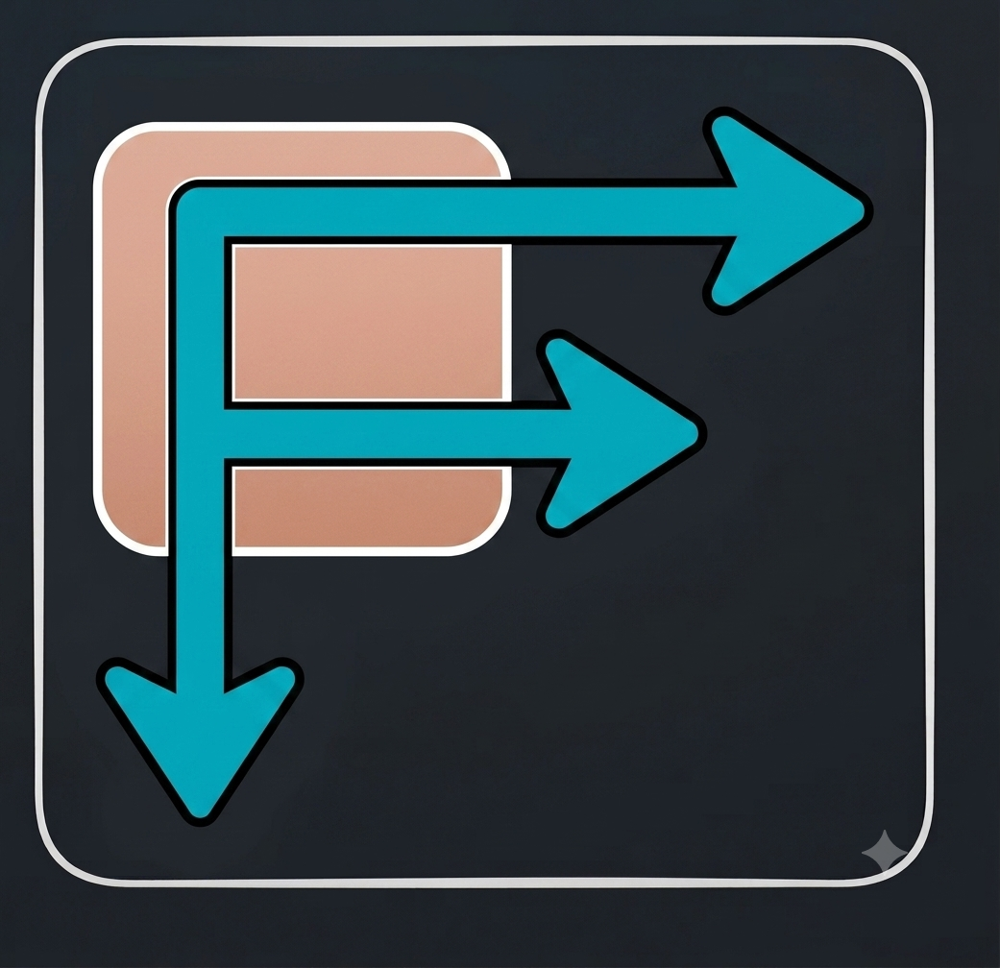

<div align="center">



# FreeTube Redirect

**Open every YouTube link in [FreeTube](https://freetubeapp.io/) from anywhere on your system.**


</div>

---

Web Extension that's compatible with Chrome. Intercept requests made from Chrome or any desktop application to open YouTube, and instead open and access your link in FreeTube.

**When attached to your default browser:**
- Works from external apps and intra-browser navigation.
- Support links for videos, Shorts, live streams, playlists, and channels
- Same-tab redirection keeps your current browser page open
- No data collection, literally just rewrites navigations locally and creates a resettable counter

---

## Prerequisites

### 1. Install FreeTube

Download and install **[FreeTube from here](https://freetubeapp.io/#download)**.

<div align="center">
  
</div>

### 2. Enable new windows for passed in URLs in FreeTube

Open FreeTube → **Settings** → **General** and toggle on the option to open links passed to FreeTube in a new window. Without this, each new link replaces whatever video is currently playing.

<div align="center">
  
</div>

### 3. Make sure the Extension is unpacked in your default browser, and that is Chrome or Edge

> Links clicked in external apps (Discord, Slack, email clients, etc.) are routed through your default browser.
> If the extension is on a non-default browser, it won't have te opportunity to intercept.

---

## Setup

1. Clone the repo wherever you keep local projects:

   ```bash
   git clone https://github.com/anjo-mi/freeDirect.git
   ```

2. Open your browser's extensions page: `chrome://extensions` (or `edge://extensions`)

3. Toggle on **Developer mode** (top-right corner)

4. Click **Load unpacked** and select the cloned folder `/freeDirect`

<div align="center">
  
 </div>

5. Open a YouTube link from your browser or any external app. **⚠️ You will be asked to grant permission for FreeTube to be opened. ⚠️ You will then have to manually close the YouTube page on this initial set up run!!! ⚠️**

6. As long as Permission was granted, all subsequent runs should work as expected. If permission was accidentally denied, see [This section](#missed-or-denied-the-permission-prompt)

---

## First run: granting permission

The very first time the extension hands a link to FreeTube, your browser will ask for permission to open the app. **⚠️ On this first attempt, the browser tab is intentionally left open ⚠️** so the prompt has time for you to respond.

When the dialog appears:

1. Check **"Always allow"**
2. Click **Open FreeTube**
3. Close the leftover tab yourself, just this once

Every link after that opens in FreeTube with the browser tab closing automatically.

---

## Missed or denied the permission prompt?

If FreeTube isn't opening (for example, you dismissed or denied the first prompt), you can re-create the first-run behavior:

1. Click the extension icon in the toolbar
<div align="center">
  
</div>
2. Click **Reset first run**
3. Open another YouTube link and the tab should stay open again so you can grant permission properly

---

<div align="center">

## Issues

Run into a problem or have a suggestion?
**[Open an issue](../../issues)** on this repo or reach out — happy to help.

</div>
